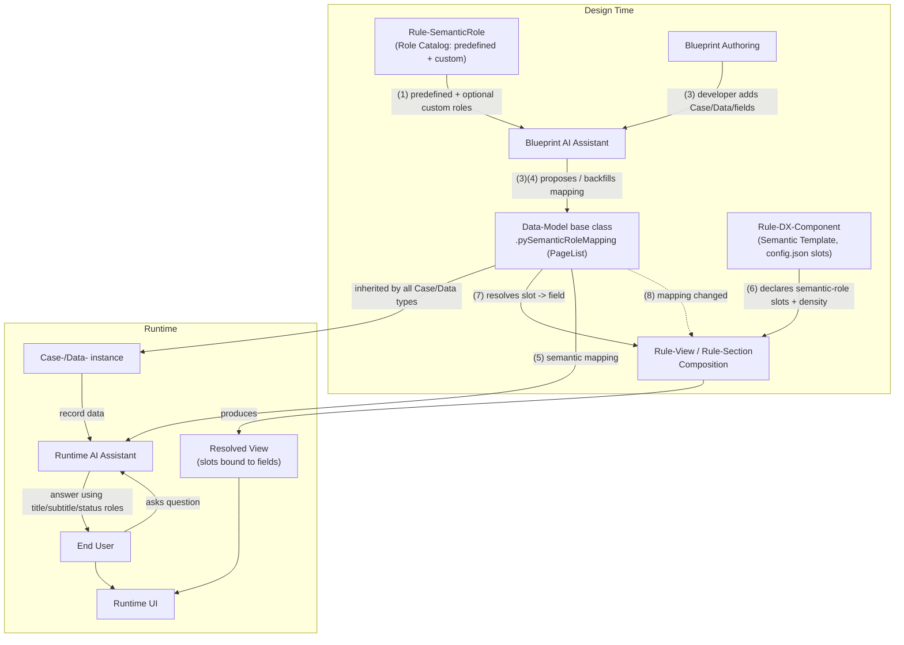
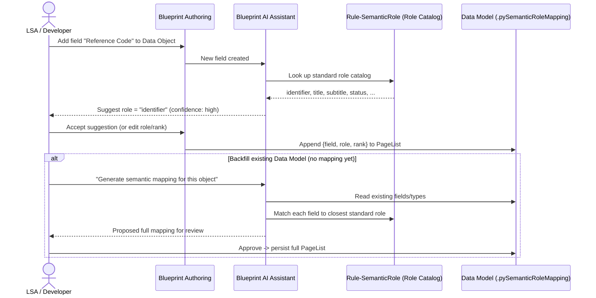
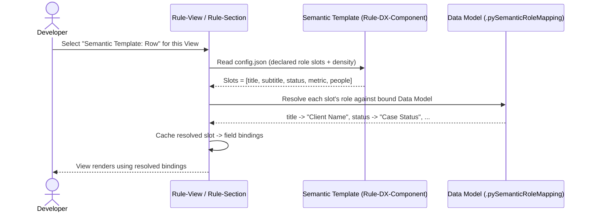
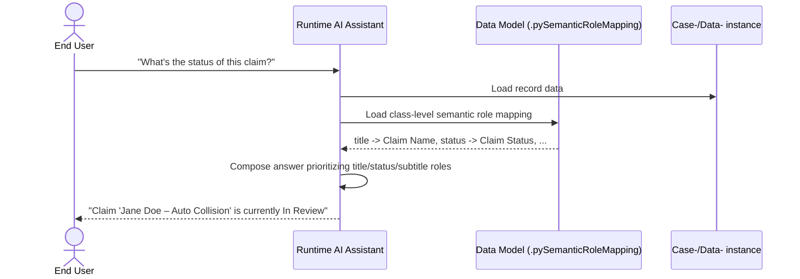
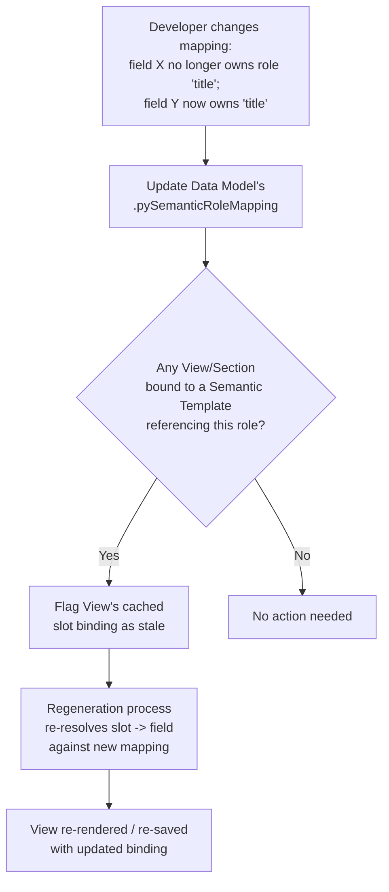

# Semantic Role — Pega Platform Architecture

This document captures the proposed architecture for introducing **Semantic Role** as a
first-class Pega Platform capability: a new rule type, a base-class mapping property, an
AI-assisted authoring flow in Blueprint, a new category of Data-Model-agnostic DX Components
("Semantic Templates"), and the runtime consumption of that mapping by both the rendering
engine and the AI Assistant.

Five diagrams are provided:

1. Container/Component overview (design time vs. runtime)
2. Sequence — Author a Data Model with semantic roles
3. Sequence — Compose a View using a Semantic Template
4. Sequence — Runtime AI Assistant answers a question about a record
5. Flow — Remap a role and regenerate views

A traceability table at the end maps each of the 8 source requirements back to the diagram(s)
and node(s) that represent it.

---

## Diagram 1 — Container/Component overview

---

## Diagram 2 — Sequence: Author a Data Model with semantic roles

---

## Diagram 3 — Sequence: Compose a View using a Semantic Template

---

## Diagram 4 — Sequence: Runtime AI Assistant answers a question about a record

---

## Diagram 5 — Flow: Remap a role and regenerate views

---

## Traceability

| # | Requirement (from source description) | Diagram(s) / Node(s) |
|---|------------------------------------------|------------------------|
| 1 | SemanticRole is a new Rule Type in Pega Platform | Diagram 1 — `Rule-SemanticRole` node |
| 2 | Roles are predefined; customers can rarely define custom roles (only if they own a consuming template) | Diagram 1 — `Rule-SemanticRole` (Role Catalog: predefined + custom) |
| 3 | In Blueprint, semantic role mapped to fields when authoring Case/Data objects; Blueprint AI Assistant knows standard role-to-field mapping | Diagram 1 — `BPA`/`BPAI` edges; Diagram 2 — full sequence |
| 4 | Blueprint AI Assistant can also generate mapping for existing objects (default mapping), stored as a PageList on the Data Model base class | Diagram 2 — "Backfill existing Data Model" `alt` block; Diagram 1 — `DM` node |
| 5 | Runtime AI Assistant uses data-model + semantic mapping to respond using title/subtitle roles instead of random fields | Diagram 1 — `RAI` edges; Diagram 4 — full sequence |
| 6 | Runtime UI templates are Data-Model-agnostic DX Components ("Semantic Templates") whose config.json annotates semantic-role slots | Diagram 1 — `STC` node; Diagram 3 — config.json read step |
| 7 | View composition references a Semantic Template with slots sized by information density; resolves slot -> field via mapping | Diagram 1 — `STC -> VC -> DM` edges; Diagram 3 — full sequence |
| 8 | Changing the mapping (slot now points to a different field) triggers view regeneration | Diagram 1 — dashed `DM -.-> VC` edge; Diagram 5 — full flow |
